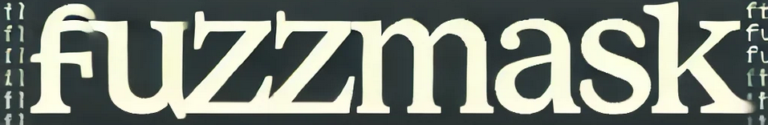
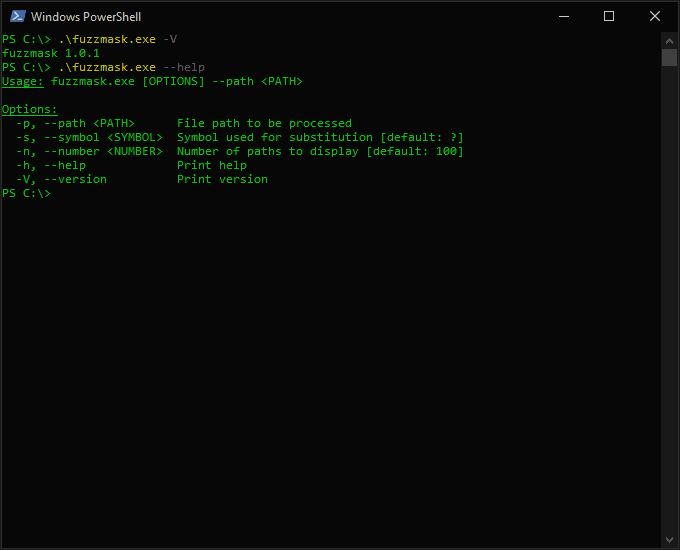

<p align="center">
    
</p>

<p align="center">
    fuzzm*?k is a Rust-based tool that aims to obfuscate Windows living-off-the-land binary paths for PowerShell use.
</p>

## About

fuzzm*?k it’s about a series of techniques designed to obscure binary executable paths and increase the complexity of static analysis, using various encoding methods and transformations to evade detection and challenge reverse engineering efforts.

On its own, it does little; it’s meant to be part of a broader attack framework, adding level to multi-layered offensive operations.

- [Patterns](#patterns)
- [Quick Start](#quick-start)
    - [Windows](#windows)
    - [Linux / macOS](#linux--macos)
    - [Docker](#docker)
- [Options](#options)
- [Contributing](#contributing)

## Patterns

- `?` matches exactly one character, allowing subtle character substitutions within a binary path while still resolving correctly.

- `*` can match any sequence of characters, allowing a path to resolve even if characters at the beginning, middle, or end of a binary name are obscured.

- _More to be added soon™._

    - Example: `i''Ex''""([cHaR]67+":\*\*e*\?''???''??K?''.*E")`

<p align="center">
    
</p>

All printed paths are verified to match and resolve the original input, this is confirmed using the `Get-Item -Path` PowerShell command.

## Quick Start

### Windows

1. **Install Rust**:  
    Visit the [Rust installation page](https://www.rust-lang.org/tools/install) and follow the instructions to install Rust using `rustup`.

2. **Clone the Repository**:
    ```powershell
    git clone https://github.com/takitakitanana/fuzzmask.git; cd fuzzmask
    ```

3. **Build and Run fuzzmask**:

    - a) **Run in Development Mode**:
        ```powershell
        cargo run -- --path C:\Windows\System32\schtasks.exe
        ```

    or

    - b) **Build and Run the Release Binary**:
        ```powershell
        cargo build --release
        .\target\release\fuzzmask.exe --path C:\Windows\System32\schtasks.exe
        ```

### Linux / macOS

1. **Install Rust**:  
    Visit the [Rust installation page](https://www.rust-lang.org/tools/install) and follow the instructions to install Rust using `rustup`.

    Using rustup (Recommended):

    ```bash
    curl --proto '=https' --tlsv1.2 -sSf https://sh.rustup.rs | sh
    ```

    Follow the prompts to complete the installation. Once installed, you may need to restart your terminal or source your profile to make Rust available.

    To verify the installation, run:

    ```bash
    rustc --version
    ```

2. **Clone the Repository**:
   
    ```bash
    git clone https://github.com/takitakitanana/fuzzmask.git; cd fuzzmask
    ```

3. **Set Up for Cross-Compilation to Windows**:
   
    To compile for Windows (amd64), install the required `x86_64-pc-windows-gnu` target:

    ```bash
    rustup target add x86_64-pc-windows-gnu
    ```

    Additionally, ensure you have `gcc` installed with `mingw-w64` (for creating Windows executables) on your Linux system.
   
- On Debian/Ubuntu, you can install it with:

    ```bash
    sudo apt update && sudo apt install gcc mingw-w64 -y
    ```

- On macOS you can use [Homebrew](https://brew.sh/) to install `mingw-w64`:
    ```bash
    brew install mingw-w64
    ```

4. **Build the Release Binary for Windows (amd64)**:

    Now that the environment is set up for cross-compiling, use the following command to create a Windows executable:

    ```bash
    cargo build --release --target x86_64-pc-windows-gnu
    ```

    This will produce a Windows-compatible `.exe` file located in the `target/x86_64-pc-windows-gnu/release/` directory.

5. **Run the Windows Executable on a Windows Machine**:

    Copy the `fuzzmask.exe` file from the Linux / macOS `target/x86_64-pc-windows-gnu/release/` directory to a Windows machine. You can then run it using:

    ```powershell
    fuzzmask.exe --path C:\Windows\System32\schtasks.exe
    ```

### Docker

If you prefer to use Docker for building the Windows executable, you can use the provided `Dockerfile`. This Docker setup will handle the cross-compilation for Windows (amd64), creating a Windows-compatible executable from any environment.

1. **Install Docker**:  
    - **Windows**: Download and install Docker Desktop from [Docker’s official site](https://www.docker.com/products/docker-desktop/).
    - **Linux**: Follow the installation instructions on [Docker’s official site](https://docs.docker.com/engine/install/) for your distribution.
    - **macOS**: Download and install Docker Desktop from [Docker’s official site](https://www.docker.com/products/docker-desktop/).

2. **Clone the Repository**:
   
    ```bash
    git clone https://github.com/takitakitanana/fuzzmask.git; cd fuzzmask
    ```

3. **Build the Docker Image**:

    ```bash
    docker build -t fuzzmask .
    ```

4. **Build the Windows Executable (amd64)**:

    - **Windows**:
    ```powershell
    docker run --rm -v "${PWD}:/app" -v "${PWD}/target:/app/target" fuzzmask
    ```

    - **Linux / macOS**:
    ```bash
    docker run --rm -v $(pwd):/app -v $(pwd)/target:/app/target fuzzmask
    ```

    After running this command, you should find the `fuzzmask.exe` file in the `target/x86_64-pc-windows-gnu/release/` directory on your host machine.

5. **Copy and Run the Executable on a Windows Machine**:

    After building, copy the `fuzzmask.exe` file from the `target/x86_64-pc-windows-gnu/release/` directory on your Windows machine.
    
    You can run the executable as follows:

    ```powershell
    fuzzmask.exe --path C:\Windows\System32\schtasks.exe
    ```

## Options

<p align="center">
    
</p>

## Contributing

Contributions are welcome! Please open an issue or submit a pull request for any improvements or bug fixes.

For more details on contributing, see the [CONTRIBUTING.md](CONTRIBUTING.md) file.
