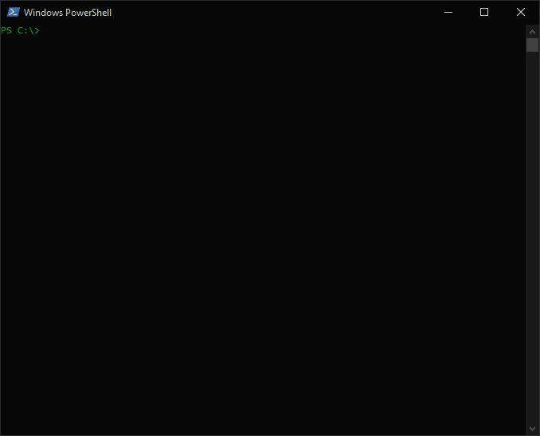
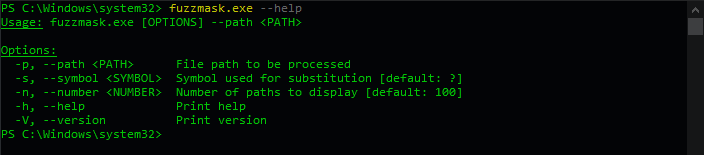

# fuzzmask

A tool designed to obfuscate and m*?k paths in PowerShell.

## Quick Start

### Windows

1. **Install Rust**:  
   Visit the [Rust installation page](https://www.rust-lang.org/tools/install) and follow the instructions to install Rust using `rustup`.

2. **Clone the Repository**:
    ```powershell
    git clone https://github.com/takitakitanana/fuzzmask.git
    ```

3. **Build and Run fuzzmask**:

    - **Navigate to the Project Directory**:
        ```powershell
        cd fuzzmask
        ```

    then

    - a) **Run in Development Mode**:
        ```powershell
        cargo run -- --path C:\Windows\System32\schtasks.exe
        ```

    or

    - b) **Build the Release Binary**:
        ```powershell
        cargo build --release
        ```

    - **Run the Release Binary**:
        ```powershell
        .\target\release\fuzzmask.exe --path C:\Windows\System32\schtasks.exe
        ```

### Linux

1. **Install Rust**:  
   Visit the [Rust installation page](https://www.rust-lang.org/tools/install) and follow the instructions to install Rust using `rustup`.

   Using rustup (Recommended):

    ```bash
    curl --proto '=https' --tlsv1.2 -sSf https://sh.rustup.rs | sh
    ```

   This command downloads and runs the Rust installer script. Follow the prompts to complete the installation. Once installed, you may need to restart your terminal or source your profile to make Rust available.

   To verify the installation, run:

    ```bash
    rustc --version
    ```

2. **Clone the Repository**:
   
    ```bash
    git clone https://github.com/takitakitanana/fuzzmask.git
    cd fuzzmask
    ```

3. **Set Up for Cross-Compilation to Windows (amd64)**:
   
   To compile for Windows, install the required `x86_64-pc-windows-gnu` target:

    ```bash
    rustup target add x86_64-pc-windows-gnu
    ```

   Additionally, ensure you have **GCC** installed with `mingw-w64` (for creating Windows executables) on your Linux system. On Debian/Ubuntu, you can install it with:

    ```bash
    sudo apt update
    sudo apt install mingw-w64 -y
    ```

4. **Build the Release Binary for Windows (amd64)**:

   Now that the environment is set up for cross-compiling, use the following command to create a Windows executable:

    ```bash
    cargo build --release --target x86_64-pc-windows-gnu
    ```

   This will produce a Windows-compatible `.exe` file located in the `target/x86_64-pc-windows-gnu/release/` directory.

5. **Run the Windows Executable on a Windows Machine**:

   Copy the `fuzzmask.exe` file from the Linux `target/x86_64-pc-windows-gnu/release/` directory to a Windows machine. You can then run it using:

    ```powershell
    fuzzmask.exe --path C:\Windows\System32\schtasks.exe
    ```

## Usage

### Demo



### Options



## Contributing

Contributions are welcome! Please open an issue or submit a pull request for any improvements or bug fixes.
