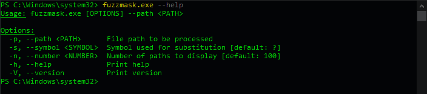

# fuzzmask

A tool designed to obfuscate and m*?k paths in PowerShell.

## Quick Start

### Windows

1. **Install Rust**:  
   Visit the [Rust installation page](https://www.rust-lang.org/tools/install) and follow the instructions to install Rust using `rustup`.

2. **Clone the Repository**:
    ```powershell
    git clone https://github.com/takitakitanana/fuzzmask.git
    ```

3. **Build and Run fuzzmask**:

    - **Navigate to the Project Directory**:
        ```powershell
        cd fuzzmask
        ```

    then

    - a) **Run in Development Mode**:
        ```powershell
        cargo run -- --path C:\Windows\System32\schtasks.exe
        ```

    or

    - b) **Build the Release Binary**:
        ```powershell
        cargo build --release
        ```

    - **Run the Release Binary**:
        ```powershell
        .\target\release\fuzzmask.exe --path C:\Windows\System32\schtasks.exe
        ```

### Linux

*Coming soon...*

## Usage

### Demo


### Options



## Contributing

Contributions are welcome! Please open an issue or submit a pull request for any improvements or bug fixes.
